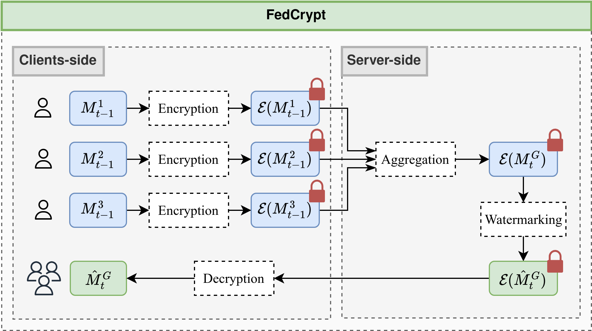
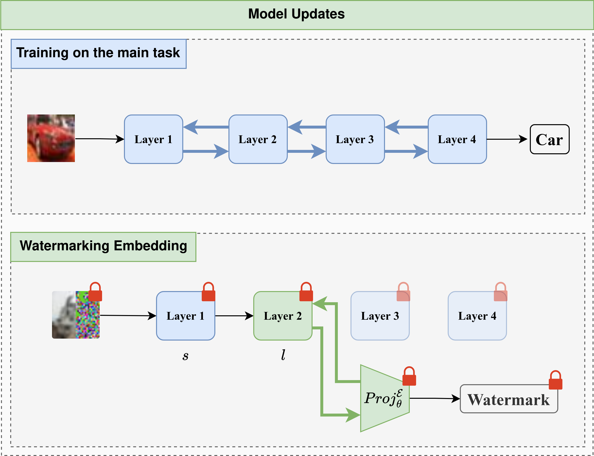
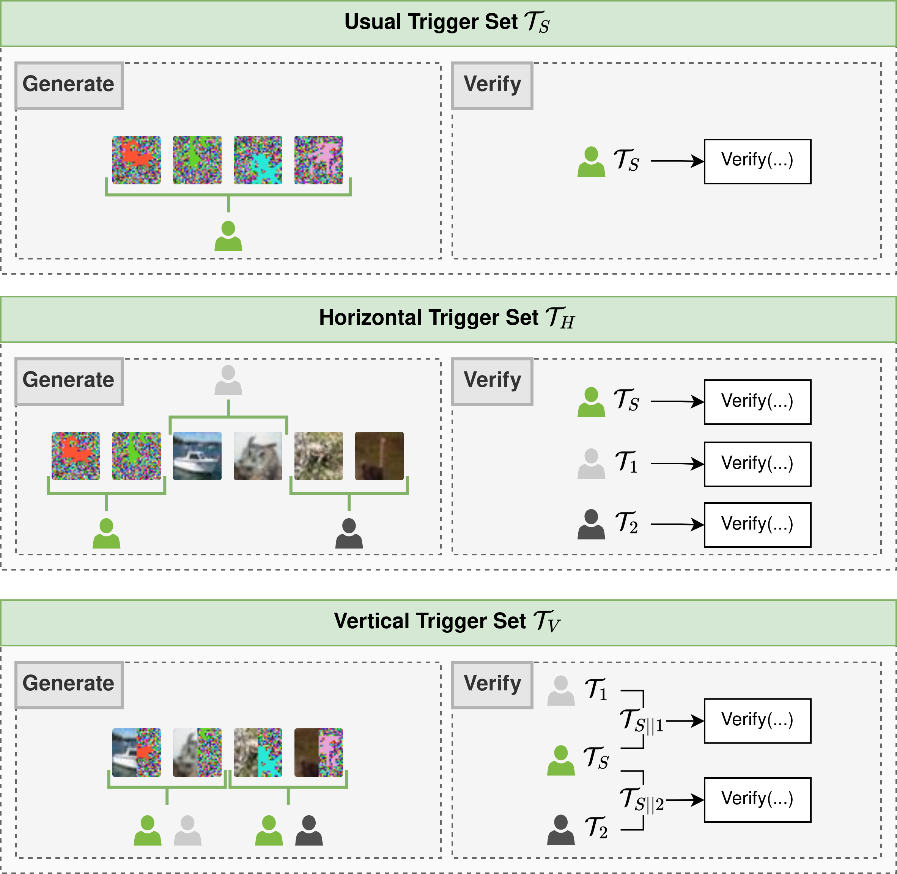

# FedCrypt

This repository contains the implementation of the paper "FedCrypt: A Dynamic White-Box Watermarking Scheme for Homomorphic Federated Learning".

The paper is under review to the IEEE Transactions on Dependable and Secure Computing journal.

<figure style="text-align: center;">
  
  <figcaption>Figure 1 : Overview of the FedCrypt scheme.</figcaption>
</figure>

## Introduction

*FedCrypt* the first dynamic white-box watermarking technique compatible with HE in FL. FedCrypt involves training a 
projection function on the activations of the encrypted model using a trigger set, preserving client privacy and enabling 
new verification protocols for joint ownership proof between the server and clients without disclosing private information. 

## The FedCrypt Algorithm

The *FedCrypt* algorithm consists on embedding a watermark in the encrypted model from the server-side.
To do so, It dynamically embeds a watermark by processing a set of homomorphically encrypted inputs, derived from a 
specific trigger set, into the encrypted model and extracting corresponding features from a designated layer. 
A deep neural network (DNN), functioning as a projection function, is then used to classify these extracted 
features to embed the watermark. The main contribution of this work lies in modifying the projection mechanism from 
existing dynamic DNN watermarking methods [[1]](#1) [[2]](#2) [[3]](#3) for implementation in the homomorphically encrypted domain. 
This contribution optimizes the watermark embedding process by approximating non-polynomial functions with low-degree 
polynomials, ensuring the non-linearity and convergence of the projection mechanism while being compatible with HE. A
simple illustration of this process is shown in Figure 2.

<figure style="text-align: center;">
  
  <figcaption>Figure 2 : Illustration of the difference between the training process and the watermarking process on a 
four-layer neural network.</figcaption>
</figure>

We introduce two new types of trigger sets for our encrypted watermark embedding process, enabling shared IP verification 
between the server and clients. The horizontal trigger set allows independent verification by both parties, while the
vertical trigger set requires joint verification. Both are illustrated in Figure 3.

<figure style="text-align: center;">
  
  <figcaption>Figure 3 : Illustration of the possible generation and corresponding verification protocols that can be 
performed using FedCrypt.</figcaption>
</figure>


## Setup

### Requirements

- Python 3.10 or higher
- matplotlib==3.8.4
- numpy==2.0.0
- Pillow==10.4.0
- scikit_learn==1.4.2
- tenseal==0.3.14
- torch==2.3.0
- torchvision==0.18.0
- tqdm==4.66.2

### Installation

Create a virtual environment and run activate it :

```bash
python3 -m venv venv
source venv/bin/activate
```

Install the required packages :

```bash
pip install -r requirements.txt
```

## Training

The FL training can be performed using the following command :

```bash
python main.py
```

Where ```main.py``` contains the configuration about the training process.

The user can choose between the class ```Server_Real_FHE``` and ```Server_Simulated_FHE``` to perform the training
using the real or simulated FHE, respectively.

For each experiment the user can create an instance of the class ```Server_*_FHE``` as follows :

```python
server = Server_*_FHE(model, dataset, nb_clients)
```

Where :

- ```model``` is the model to be trained among those which are listed in the ```./src/model/model_choice.py``` file. 
- ```dataset``` is the dataset to be used among those which are listed in the ```./src/dataset/data_splitter.py``` file.
- ```nb_clients``` is the number of clients to be used in the FL process.

Then the FL training can be performed using the following line :

```python
server.train(max_rounds, lr_client, lr_pretrain, lr_retrain)
```

Where :
- ```max_rounds``` is the number of rounds to be performed in the FL process. 
- ```lr_client``` is the learning rate used by the clients during the training process.
- ```lr_pretrain``` are the learning rates used by the server during the pre-embedding of the watermark.
- ```lr_retrain``` are the learning rates used by the server during the embedding of the watermark.

### Real FHE

Real FHE use the TenSEAL library to perform the watermark embedding using encrypted parameters. The parameters related 
to the CKKS cryptosystem can be found in the constructor of ```Server_Real_FHE``` in
```./src/federated_learning/server_real_fhe.py``` file.

### Simulated FHE

Simulated FHE use only the PyTorch library to perform the watermark embedding using plaintext parameters.

## Removal Attacks

The removal attacks can be performed using the following command :

```bash
python removal_attack.py
```

Where ```removal_attack.py``` contains the configuration about the removal attack process. The user can perform one of the
following attacks :

- Fine-tuning
- Pruning
- Overwriting

## Citation

Cite as: Mohammed Lansari, Reda Bellafqira, Katarzyna Kapusta, et al. FedCrypt: A Dynamic White-Box Watermarking Scheme for Homomorphic Federated Learning. TechRxiv. July 16, 2024. DOI: 10.36227/techrxiv.172114666.63343276/v1Registration in progress

## References
<a id="1">[1]</a> 
B. Darvish Rouhani, H. Chen, and F. Koushanfar, “Deep-
signs: An end-to-end watermarking framework for own-
ership protection of deep neural networks,” in Proceed-
ings of the Twenty-Fourth International Conference on
Architectural Support for Programming Languages and
Operating Systems, 2019, pp. 485–497

<a id="2">[2]</a>
R. Bellafqira and G. Coatrieux, “Diction: Dynamic ro-
bust white box watermarking scheme,” arXiv preprint
arXiv:2210.15745, 2022.

<a id="3">[3]</a>
S. Yu, J. Hong, Y. Zeng, F. Wang, R. Jia, and
J. Zhou, “Who leaked the model? tracking ip infringers
in accountable federated learning,” arXiv preprint
arXiv:2312.03205, 2023.