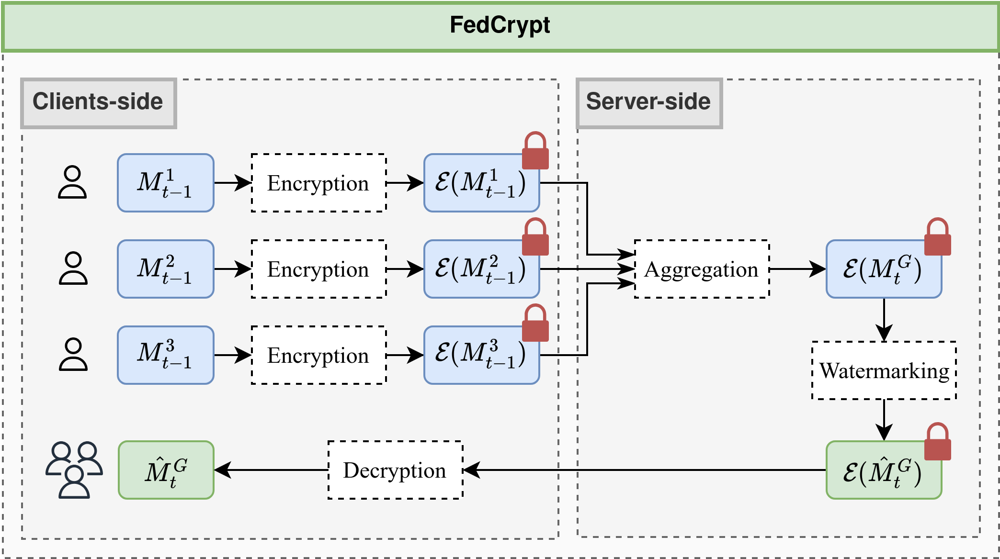
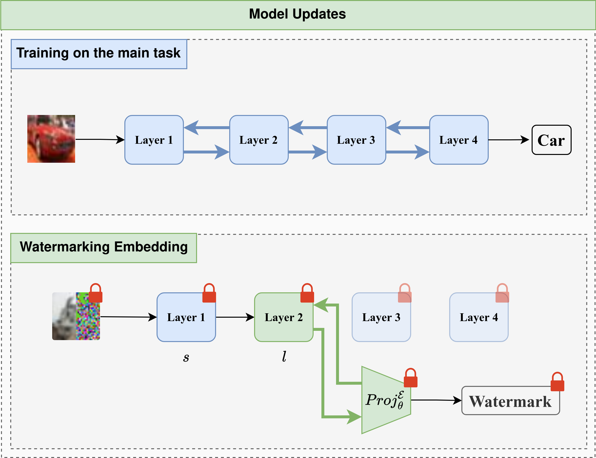
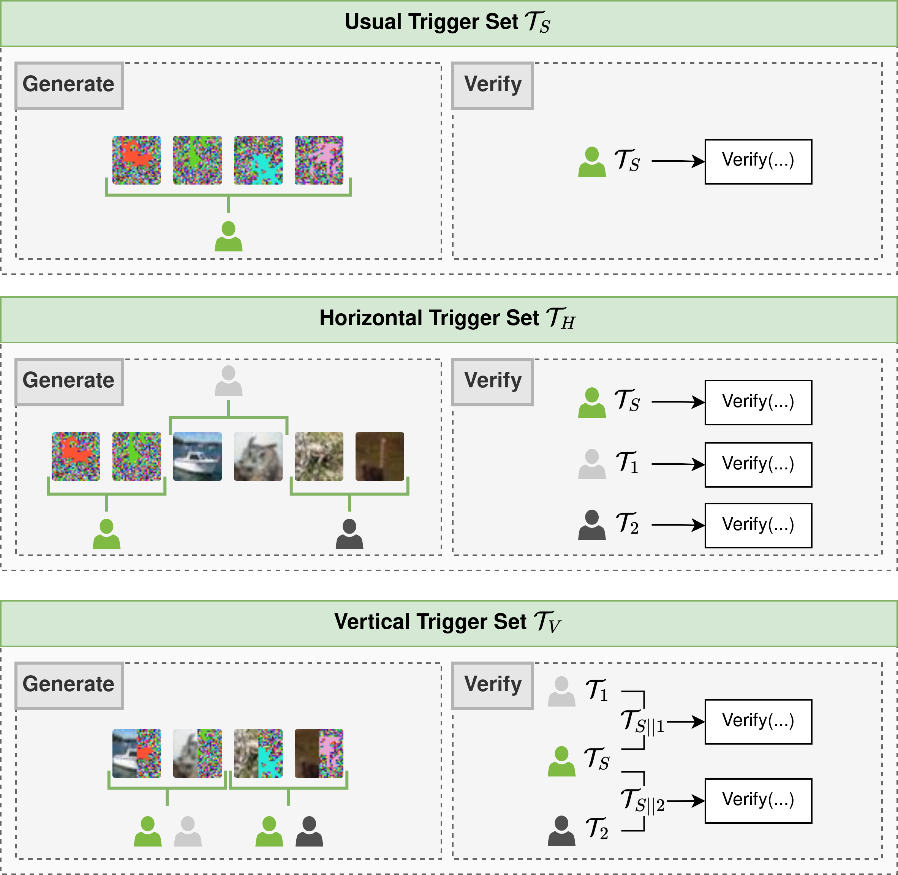

# FedCrypt

This repository contains the implementation of the paper "FedCrypt: A Dynamic White-Box Watermarking Scheme for Homomorphic Federated Learning".

The paper is under review to the IEEE Transactions on Dependable and Secure Computing journal.

The paper can be found in a preprint version [here](https://www.techrxiv.org/users/796552/articles/1183818-fedcrypt-a-dynamic-white-box-watermarking-scheme-for-homomorphic-federated-learning).

<figure style="text-align: center;">
  
  <figcaption>Figure 1 : Overview of the FedCrypt scheme.</figcaption>
</figure>

## Introduction

*FedCrypt* is the first dynamic white-box watermarking technique compatible with HE in FL. FedCrypt involves training a 
projection function on the activations of the encrypted model using a trigger set, preserving client privacy and enabling 
new verification protocols for joint ownership proof between the server and clients without disclosing private information. 

## The FedCrypt Algorithm

The *FedCrypt* algorithm consists on embedding a watermark in the encrypted model from the server-side.
To do so, It dynamically embeds a watermark by processing a set of homomorphically encrypted inputs, derived from a 
specific trigger set, into the encrypted model and extracting corresponding features from a designated layer. 
A deep neural network (DNN), functioning as a projection function, is then used to classify these extracted 
features to embed the watermark. The main contribution of this work lies in modifying the projection mechanism from 
existing dynamic DNN watermarking methods [[1]](#1) [[2]](#2) [[3]](#3) for implementation in the homomorphically encrypted domain. 
This contribution optimizes the watermark embedding process by approximating non-polynomial functions with low-degree 
polynomials, ensuring the non-linearity and convergence of the projection mechanism while being compatible with HE. A
simple illustration of this process is shown in Figure 2.

<figure style="text-align: center;">
  
  <figcaption>Figure 2 : Illustration of the difference between the training process and the watermarking process on a 
four-layer neural network.</figcaption>
</figure>

We introduce two new types of trigger sets for our encrypted watermark embedding process, enabling shared IP verification 
between the server and clients. The horizontal trigger set allows independent verification by both parties, while the
vertical trigger set requires joint verification. Both are illustrated in Figure 3.

<figure style="text-align: center;">
  
  <figcaption>Figure 3 : Illustration of the possible generation and corresponding verification protocols that can be 
performed using FedCrypt.</figcaption>
</figure>


## Setup

### Requirements

- Python 3.10 or higher
- matplotlib==3.8.4
- numpy==2.0.0
- Pillow==10.4.0
- scikit_learn==1.4.2
- tenseal==0.3.14
- torch==2.3.0
- torchvision==0.18.0
- tqdm==4.66.2

### Installation

Clone the repository :

```bash
git clone https://github.com/medlansari/FedCrypt
cd FedCrypt
```

Create a virtual environment and run activate it :

```bash
python3 -m venv venv
source venv/bin/activate
```

Install the required packages :

```bash
pip install -r requirements.txt
```

## Training

The FL training can be performed using the ```main.py``` file. The user can choose to perform the watermark embedding using the
plaintext or the encrypted model using the flag ```--plaintext``` or ```--encrypted```, respectively. It can also choose
the configuration of the Federated Learning (model, dataset, homomorphic encryption scheme etc.) using the flags ```--cfgFl```
and ```--cfgFhe```.

An example of each way to launch the FL process and embed the watermark can be found in the following sections.

### Real FHE

Real FHE uses the TenSEAL library to perform the watermark embedding using encrypted parameters. 

To run the training, the user should :
- Specify the flag ```--encrypted```.
- Gives the path of the ```.yaml``` file that contains the configuration of the
Federated Learning using ```--cfgFl```. The configuration file should be similar to the ones in ```./config/federated_learning/real_*.yaml```.
- Gives the path of the ```.yaml``` file that contains the configuration of the FHE scheme using ```--cfgFhe```. The configuration file should be similar to the ones in ```./config/fhe_scheme/*.yaml```.

For example, to use the watermark embedding using the encrypted model and VGG, the user can use the following command :

```bash
python main.py --encrypted --cfgFl ./config/federated_learning/real_vgg.yaml --cfgFhe ./config/fhe_scheme/with_refresh.yaml
```


### Simulated FHE

Simulated FHE uses only the PyTorch library to perform the watermark embedding using plaintext parameters. 

To run the training, the user should :
- Specify the flag ```--plaintext```.
- Gives the path of the ```.yaml``` file that contains the configuration of the
Federated Learning using ```--cfgFl```. The configuration file should be similar to the ones in ```./config/federated_learning/simulated_*.yaml```.

For example, to use the watermark embedding using the plaintext model with ResNet18, the user can use the following command :

```bash
python main.py --plaintext --cfgFl ./config/federated_learning/simulated_resnet.yaml
```

## Removal Attacks

The removal attacks can be performed using the following command :

```bash
python removal_attack.py
```

Where ```removal_attack.py``` contains the configuration about the removal attack process. The user can perform one of the
following attacks :

- Fine-tuning
- Pruning
- Overwriting

## Citation

Cite as: Mohammed Lansari, Reda Bellafqira, Katarzyna Kapusta, et al. FedCrypt: A Dynamic White-Box Watermarking Scheme for Homomorphic Federated Learning. TechRxiv. July 16, 2024. 
DOI: [10.36227/techrxiv.172114666.63343276/v1](https://doi.org/10.36227/techrxiv.172114666.63343276/v1 "DOI")

## References
<a id="1">[1]</a> 
B. Darvish Rouhani, H. Chen, and F. Koushanfar, “Deep-
signs: An end-to-end watermarking framework for own-
ership protection of deep neural networks,” in Proceed-
ings of the Twenty-Fourth International Conference on
Architectural Support for Programming Languages and
Operating Systems, 2019, pp. 485–497

<a id="2">[2]</a>
R. Bellafqira and G. Coatrieux, “Diction: Dynamic ro-
bust white box watermarking scheme,” arXiv preprint
arXiv:2210.15745, 2022.

<a id="3">[3]</a>
S. Yu, J. Hong, Y. Zeng, F. Wang, R. Jia, and
J. Zhou, “Who leaked the model? tracking ip infringers
in accountable federated learning,” arXiv preprint
arXiv:2312.03205, 2023.